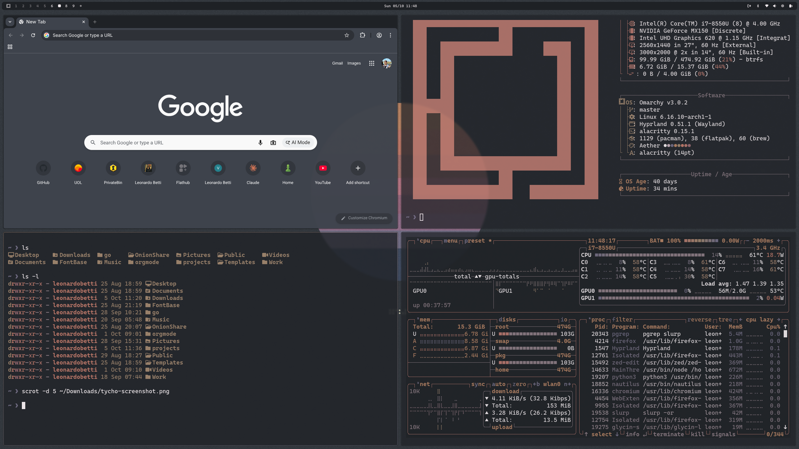

# omarchy-tycho
Omarchy-Tycho is a minimalist dark pastel theme for [Omarchy Linux](https://omarchy.org/) inspired by the ambient soundscapes and visual aesthetics of musician/designer [Tycho (Scott Hansen)](https://tychomusic.com).

### Installation

To install this theme, simply use the `omarchy-theme-install` command:

```bash
omarchy-theme-install https://github.com/leonardobetti/omarchy-tycho
```


#### Inspiration

[Tycho](https://tychomusic.com) is the musical project of Scott Hansen, an American musician, producer, and designer based in San Francisco. Hansen creates ambient electronic music that blends analogue synthesisers, live instrumentation, and atmospheric soundscapes. Tycho's music combines downtempo, ambient, and electronic elements with organic instrumentation. The sound features layered synthesisers, melodic bass lines, and guitar work that creates immersive, cinematic atmospheres.


## Demo


## Wallpapers


___

#### Main Albums

- **[Dive](https://open.spotify.com/album/4CBUbnGFz2iKFJjYqRIwst)** (2011) - Breakthrough album featuring tracks like "A Walk" and "Hours"
- **[Awake](https://open.spotify.com/album/7D3y8oWEQ1Lwz10D0Cg0Q6)** (2014) - Grammy-nominated album with a fuller band sound
- **[Epoch](https://open.spotify.com/album/1ZTNnmqXodDCFF9tXUPrkw)** (2016) - Continued evolution with more dynamic arrangements
- **[Weather](https://open.spotify.com/album/4zrVrsO113smesPZMbBA8I)** (2019) - First album to feature vocals by singer Saint Sinner

#### ISO50

[ISO50](https://iso50.com) is Hansen's design studio and blog. The name references the ISO film speed setting used in photography. Through ISO50, Hansen creates visual work that mirrors his musical aesthetic—minimalist compositions featuring geometric forms, gradients, and pastel colour palettes. The studio produces album artwork, posters, and design work that has become synonymous with the Tycho brand.


#### Links

- [Official Website](https://tychomusic.com)
- [ISO50 Design Studio](https://iso50.com)
- [Spotify](https://open.spotify.com/artist/5oOhM2DFWab8XhSdQiITry)


___
#### TODO / WIP
- [ ] add [VS Cocde](https://code.visualstudio.com/) theme
- [ ] add [bottom / btm](https://github.com/ClementTsang/bottom) theme
- [ ] add theme video on github
